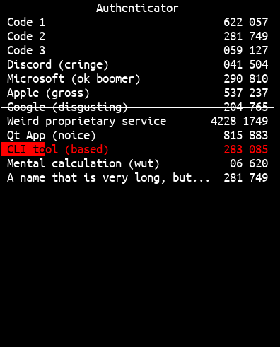

# passrs ~ Terminal Password Manager & Authenticator
A "GUI" password and 2FA code manager, essentially a direct upgrade from [my C terminal authenticator](https://github.com/64-Tesseract/ncAuth).

**Important note:** You need to install Xorg libraries (`xorg-devel`, `libxcb-devel`) for *passrs* to compile the clipboard module.

## Features
- Scriptability with command-line arguments and environment variables
- `Option<Encryption>` using a 32-byte master password (shorter passwords are padded with `\0`s, longer ones are clipped)
- Vim-ish keybindings
- Copy password or 2FA token to clipboard, you can also view the next 2FA token if you alt-tab slowly
- Unicode auto-password generation (what hacker would even *try* to guess `񗗷􀛿𒔽𴕙򑑌󚖵񪣼򧩮󟛢򎈢􄪠񇻲󶽽񄒀񿕗񩝗`?)  
  ~~yeah ok but what website would even *try* support it? like it doesn't even have a single uppercase letter or special symbol~~
- Passwords show you how to type each non-standard character using ctrl-shift-U (in edit mode, move the cursor along each character)
- 40x more bloated than the C version

## Usage
I won't go over every detail, since `passrs --help` should tell you all you need. But for a quick rundown:

- Specify a different data file with `--file FILE` to securely store different sets of passwords, 2FA codes, and your colour theme (arguably the most important bit)  
  Defaults to `~/.local/share/passrs`, in protest of cluttered home folders
- Switch between 2FA codes and passwords with `Tab`, navigate with arrow/Vim keys
- Press `o` to create a new password or 2FA code, or `e` on an existing one to edit it  
  (You can only navigate with arrow keys in edit mode, Vim keys would type into text fields ~~Idea: use the main keyboard for typing, have a separate keyboard solely for Vim navigation~~)
- Press `Enter` to save the edited item or `Esc` to cancel editing it, then `Esc` or `q` to quit the main GUI and save

## FAQ
(Each question was asked exactly zero (0) times, but with my social life I consider that frequent)

- **What does this thing run on?**  
  Anything that compiles Rust and that all the libraries support, which should also be anything that compiles Rust.
- **How secure are the encrypted passwords/2FA codes?**  
  I wouldn't bet much on the security if glowies got their hands on it, but it should be enough to stop the average Kali "hacker". Refer to [some "onion" library I use](https://docs.rs/orion/0.15.5/orion/index.html) for actual details.
- **Do Unicode passwords even work in websites? How are weird characters handled by server software?**  
  Hell if I know, I've had this idea for ages but never got a chance to test it out. ~~Be my test subjects and brick your accounts for me >:)~~
- **How about clipboard for Wayl--**  
  ew no  
  ...Alright fine, I'm stuck with Sway on SXMO, so I guess you've got a point. In *ncAuth*, I simply called the user's shell script to copy stuff to any WM's clipboard, but I wasn't that big a fan of that solution.  
  Instead, I've made sure to enable CLI access to *passrs*, so you can write a shell script to select and copy passwords/2FA codes using something like `dmenu`. See [`sxmo_passrs.sh`](sxmo_passrs.sh) for an example.
- **How about Windows?**  
  ‍
- **No license?**  
  No licence, go ham. If anyone insists that "intellectual property" isn't a completely delusional concept, then I claim `1` and `0` as my own.  
  Also don't open the `NO-LICENCE` file, that's just to keep Cargo happy.
